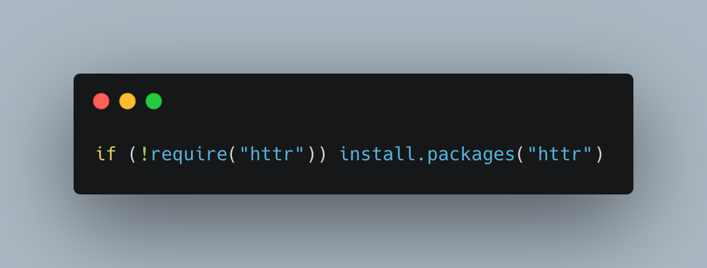
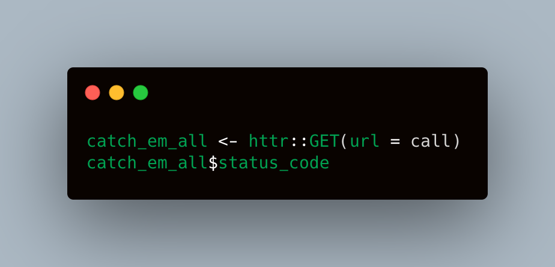
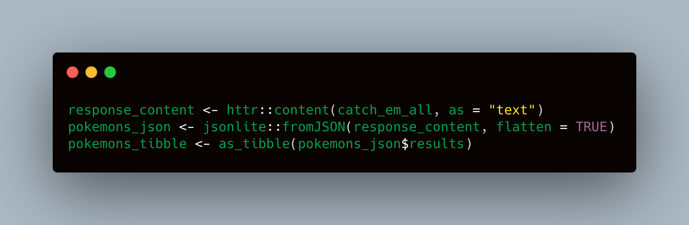
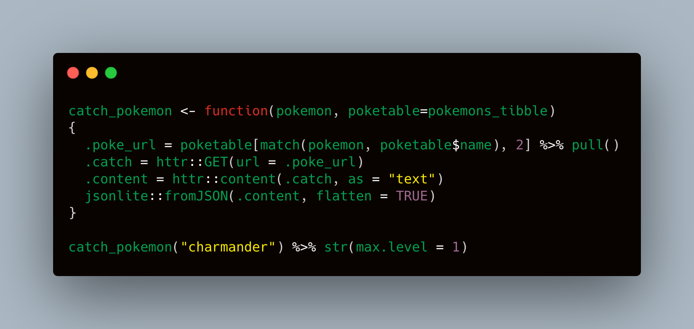
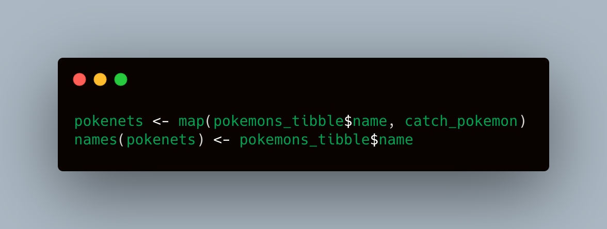

```{r setup, include=FALSE}
knitr::opts_chunk$set(background = "#FFDAB9", echo = FALSE, message = FALSE)
```


A fun way to get familiar with working with APIs and handling JSON data with nested lists into tidy and nice rectangles of data.

In this post, we are going to try to _catch_ some pokémons
using the API [pokeapi.co](https://pokeapi.co/). 


_note that in this example no authentication is required to access this API, and all resources are fully open and available_ ..

# Libs and links
We will need to load the packages \n

* `httr`: for sending http requests. [Docs for httr](https://cran.r-project.org/web/packages/httr/index.html) \n

* `jsonlite` : handy when wrangling with json like data. [Docs on jsonlite](https://cran.r-project.org/web/packages/jsonlite/index.html) \n

* `tidyverse` not necessary, base R does the job but I am quite fan of this framework. \n

Check if you have them in your local library this way:
\n


```{r check pckgs}
if (!require("httr")) install.packages("httr")
```


And load \n
```{r load em all, message =FALSE}
library(httr, quietly = TRUE, warn.conflicts = FALSE)
library(jsonlite, quietly = TRUE, warn.conflicts = FALSE)
library(tidyverse, quietly = TRUE, warn.conflicts = FALSE)
```


Set the URL the api's resource you are insterested in, Below I am looking just
for each pokemon (first 200 records) with the corresponding resource (URL). So each pokemons is an endpoint with multiple nested resources.


```{r ap}
poke_base <- "https://pokeapi.co/api/v2/"
pokemon_endpoint <- "pokemon"
records_limit <- "/?limit=200"
call <- paste0(poke_base,pokemon_endpoint,records_limit)
```


Raw json look like 
\n


# 

```{r request, message = FALSE}
catch_em_all <- httr::GET(url = call)
catch_em_all$status_code
```


We caught these beautiful creatures

```{r serialize, message = FALSE}
response_content <- httr::content(catch_em_all, as = "text")
pokemons_json <- jsonlite::fromJSON(response_content, flatten = TRUE)
pokemons_tibble <- as_tibble(pokemons_json$results)
DT::datatable(pokemons_tibble,rownames = FALSE)
```


Hit the appropriate resource url to get more info about each pokemon 
## catch first pokemon 

Custom function feels like throwing a pokeball

```{r first catch, message = FALSE}
catch_pokemon <- function(pokemon, poketable=pokemons_tibble)
{
  .poke_url = poketable[match(pokemon, poketable$name), 2] %>% pull()
  .catch = httr::GET(url = .poke_url)
  .content = httr::content(.catch, as = "text")
  jsonlite::fromJSON(.content, flatten = TRUE)
}

catch_pokemon("charmander") %>% str(max.level = 1) %>%
  DT::datatable(rownames = FALSE)
```


#
You got your charmander, now use {purrr} from to catch em all \n

```{r team rocket hold up, message = FALSE}
pokenets <- map(pokemons_tibble$name, catch_pokemon)
names(pokenets) <- pokemons_tibble$name
```


# {purrr} has got powerrr
You can for example prepare a dataset containing base stats of a pokemon
here vectorisation with purrr comes in handy.
See full documentation at [https://purrr.tidyverse.org/](https://purrr.tidyverse.org/) or read the [Hadley Wickham's R4DS book](https://r4ds.had.co.nz/vectors.html) 


```{r tidy data, message = FALSE}

stats_names <- pluck(pokenets,1,"stats","stat.name") #set column names for the final dataframe

extract_basestats <- function(pokerow) { #plucks base stats at the corresponding level in the list
  pluck(pokenets,pokerow,"stats","base_stat") %>%
    as.double() %>%
    set_names(nm = stats_names)
}

extract_type <- function(pokerow) { #same as above for pokemon type
  pluck(pokenets, pokerow, "types", "type.name") %>%
    paste() 
  }

pokenets_tbl <- tibble(pokenets) %>% # tidying a dataframe and binding the plucked data
  unnest_wider(pokenets) %>%
  select(name, height, weight) %>%
  mutate(pokedata = map(row_number(),extract_basestats)) %>%
  unnest_wider(pokedata) %>% 
  mutate(poketype = map(row_number(),extract_type)) %>%
  unnest_wider(poketype)

DT::datatable(head(pokenets_tbl,10),rownames = FALSE)
```


# 
Nice and tidy tibble as a good starting point to run a PCA or a regression..
For the sake plotting here is a correlation plot of base stats \n
¯\_( ͡❛ ͜ʖ ͡❛)_/¯    
\n

```{r, message = FALSE}
library(corrr,quietly = TRUE)

pokenets_tbl %>%
  select(height:speed) %>%
  correlate() %>%
  rearrange() %>%
  shave() %>%
  rplot(shape = 15, colours = c("darkorange", "white", "darkcyan"))
```


**Thanks for reading**


